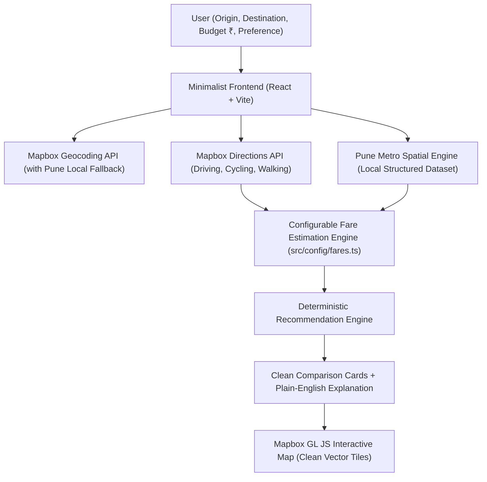

# IndiaRide (or "Marg" / "Yatriq") 🧭
## Technical Architecture & Implementation Plan: India-Focused Multimodal Navigation Engine

---

## 1. MVP Scope & Problem Statement

### Core Value Proposition
For daily Indian commuters, navigating fragmented urban transit options is overwhelming:
- Autos have regulated meter fares or street haggling.
- Bike taxis (Rapido) are fast in traffic but lack baggage comfort.
- Cabs are expensive and get trapped in choke points.
- Metro is rapid and cheap, but commuters struggle with first-mile and last-mile connectivity.

**IndiaRide** solves this with an ultra-clean, deterministic multimodal comparison tool where users provide:
1. **Starting location** (Origin)
2. **Destination** (To)
3. **Budget** (in ₹ INR)
4. **Travel preference** (`Cheapest`, `Fastest`, `Balanced`)

### Initial Target City: Pune, Maharashtra
- **Primary City for MVP**: Pune.
- **First Public Transit Integration**: **Pune Metro** (Maha Metro Line 1 Purple Line + Line 2 Aqua Line + District Court Interchange).
- **Core Modes Compared**:
  1. **Metro + First/Last Mile** (Walk/Auto to station ➔ Metro Train ➔ Walk to destination)
  2. **Auto Rickshaw** (Pune RTO official meter tariff rules)
  3. **Bike Taxi** (Rapido-style estimated fare & agile city speed)
  4. **Cab / Car** (On-demand sedan/mini estimated fare)
  5. **Walking** (For short trips under 3 km, ₹0)

---

## 2. Architecture



### Architectural Principles:
1. **Zero Backend Overhead for MVP**: Client-side execution via Vite + React. All calculations are sub-20ms, deterministic, and require zero cold-start database latencies.
2. **Modular Transit Adapters**: The transit calculation engine is abstracted as a generic `TransitNetwork` interface. This enables seamless plug-and-play addition of Mumbai Metro, BEST buses, or local trains later without touching core UI code.
3. **No Hallucinations / No Scraping**: We do not scrape Uber/Rapido (which breaks TOS). All road modes are computed via transparent, configurable rate formulas clearly labeled as **"Estimated fare"**.

---

## 3. Technology Stack

| Layer | Technology | Rationale |
|---|---|---|
| **Build & Tooling** | Vite 5+ | Instant HMR, minimal footprint, fast production builds |
| **Frontend Framework** | React 18 (TypeScript) | Type-safe, modular component tree |
| **Styling** | Tailwind CSS 3.4+ | Utility-first, zero runtime CSS overhead, pixel-perfect minimal design |
| **Icons** | Lucide React | Clean, lightweight, professional iconography |
| **Map Rendering** | Mapbox GL JS (`mapbox-gl`) | Industry standard vector tiles, crisp road lines, butter-smooth camera |
| **Geocoding & Search** | Mapbox Geocoding API | High quality Indian location search with boundary filtering |
| **Road Routing** | Mapbox Directions API | Driving (traffic), cycling, and walking distance/duration engine |

---

## 4. API Analysis & Requirements

To keep dependencies minimal and reliable, **only 1 external API provider is required**: **Mapbox**.

| API Name | Purpose | Free Tier | Credit Card Needed? | How to Obtain Key | Where Key Goes | Frontend Safety | Rate Limits & Constraints |
|---|---|---|---|---|---|---|---|
| **Mapbox Geocoding API** (`/geocoding/v5/mapbox.places`) | Search autocomplete for Pune addresses & landmarks | **100,000 requests/month free** | **NO** (Not required for free tier sign-up) | 1. Sign up at [mapbox.com](https://mapbox.com)<br>2. Go to Account Dashboard<br>3. Copy Default Public Token (`pk.eyJ...`) | `.env`<br>`VITE_MAPBOX_TOKEN=pk.xxx` | **SAFE**. Designed for frontend. Can be URL/domain restricted in Mapbox console. | 600 requests/minute. Scoped to `country=IN` and Pune bounding box `bbox=73.65,18.35,74.15,18.75` for ultra-accurate local matches. |
| **Mapbox Directions API** (`/directions/v5/mapbox/...`) | Generates road distance, time, and polyline coordinates for driving, biking, walking | **100,000 requests/month free** | **NO** | Reuses the same Mapbox Public Token | `.env`<br>`VITE_MAPBOX_TOKEN=pk.xxx` | **SAFE**. Standard public token. | 300 requests/minute. |

### Built-in Zero-API Graceful Fallback:
If a user launches the app before adding `VITE_MAPBOX_TOKEN`:
- The app detects missing token and seamlessly switches to **Pune Offline Fallback Mode**.
- Provides pre-indexed coordinates for top Pune hubs (Hinjewadi Phase 1-3, Shivajinagar, Kothrud, Viman Nagar, Pune Station, Swargate, PCMC, Baner, Wakad, Hadapsar).
- Uses Haversine spatial road circuity formulas ($\times 1.25$ road factor) so the entire app is 100% interactive and testable immediately!

---

## 5. API Setup Guide

1. Create a free account at [https://account.mapbox.com](https://account.mapbox.com).
2. Copy your **Default public token** (`pk.eyJ...`).
3. In the project root, create `.env`:
   ```bash
   VITE_MAPBOX_TOKEN=pk.eyJ1IjoieW91cnVzZXJuYW1lIiwiYSI6ImNs...
   ```
4. Run `npm run dev`. Vite automatically loads variables prefixed with `VITE_`.

---

## 6. Data Sources

1. **Road Network & Turn-by-Turn Distances**: Mapbox Directions API (`driving-traffic`, `cycling`, `walking`).
2. **Auto Rickshaw Tariffs**: Pune Regional Transport Office (RTO) official meter tariff notification:
   - Base fare: ₹25 for first 1.5 km.
   - Subsequent rate: ₹17.00 per km.
   - Night charge multiplier (after 12 AM): 1.25x.
3. **Bike Taxi Estimates**: Regional market averages (Rapido Pune):
   - Base fare: ₹20 (covers first 1 km).
   - Distance rate: ₹9.00 per km.
   - Time rate: ₹0.75 per minute.
4. **Cab / Car Estimates**: Regional ride-hailing rates (Uber Go / Ola Mini Pune):
   - Base fare: ₹60.
   - Distance rate: ₹15.50 per km.
   - Time rate: ₹1.50 per minute.
5. **Pune Metro Network**: Official Maha Metro fare and station alignment data.

---

## 7. Pune Metro Strategy

### Current Real-World Status of Pune Metro:
- **Line 1 (Purple Line)**: PCMC Bhavan to Swargate (14 stations operational, connecting North Pimpri-Chinchwad to Central Pune).
- **Line 2 (Aqua Line)**: Vanaz to Ramwadi (16 stations operational, East-West corridor through Kothrud, Deccan, PMC, Pune Station, Kalyani Nagar).
- **Interchange Station**: **Civil Court (District Court)** allows bidirectional transfer between Purple and Aqua Lines.
- **Line 3 (Hinjewadi to Shivajinagar)**: Elevated IT corridor currently under construction (noted in UI as future expansion).

### Structured Local Dataset (`src/config/metroData.ts`):
```typescript
export interface MetroStation {
  id: string;
  name: string;
  marathiName: string;
  line: 'purple' | 'aqua';
  lat: number;
  lng: number;
  order: number;
  isInterchange?: boolean;
}
```
Contains all 30 stations with exact geographic coordinates, station sequence, and interchange metadata.

### Official Pune Metro Fare Slab (Maha Metro):
| Stations Traveled | Standard Fare |
|---|---|
| 1 – 3 stations | ₹10 |
| 4 – 6 stations | ₹15 |
| 7 – 10 stations | ₹20 |
| 11 – 14 stations | ₹25 |
| 15 – 18 stations | ₹30 |
| > 18 stations | ₹35 |

### Multimodal Metro Route Algorithm:
1. Find nearest metro station to Origin ($S_{\text{origin}}$) and Destination ($S_{\text{dest}}$).
2. Check feasibility:
   - If distance to $S_{\text{origin}} > 5.0\text{ km}$ and distance to $S_{\text{dest}} > 5.0\text{ km}$, Metro is marked "Not practical for this journey" (e.g., Hinjewadi to Wakad).
   - If feasible, construct a 3-leg multimodal itinerary:
     - **Leg 1 (First-Mile)**: Walk (< 1.2 km) OR Auto feeder (> 1.2 km) to $S_{\text{origin}}$.
     - **Leg 2 (Metro Train)**: Board at $S_{\text{origin}}$, ride along line (with District Court interchange if lines differ), arrive at $S_{\text{dest}}$. Travel time calculated at 35 km/h commercial average + 2 mins station dwell/transfer buffer.
     - **Leg 3 (Last-Mile)**: Walk from $S_{\text{dest}}$ to final destination.

---

## 8. Folder Structure

```
src/
├── assets/                  # Brand assets and clean SVG icons
├── config/
│   ├── fares.ts             # SINGLE SOURCE OF TRUTH for all fare parameters
│   ├── metroData.ts         # Verified Pune Metro stations and line graph
│   └── puneLandmarks.ts     # Curated Pune hotspots (Hinjewadi, Shivajinagar, etc.)
├── types/
│   └── index.ts             # LocationPoint, RouteOption, PreferenceMode, FareBreakdown
├── services/
│   ├── mapbox.ts            # Mapbox Geocoding & Directions API client + offline fallback
│   ├── metroEngine.ts       # Pune Metro station discovery, interchange graph & fares
│   ├── fareEngine.ts        # Pure deterministic cost calculation functions
│   └── recommender.ts       # Deterministic scoring & plain-English explanation builder
├── components/
│   ├── Header.tsx           # Minimal, elegant brand header (Xeroxic-style)
│   ├── SearchCard.tsx       # Crisp, distraction-free input (From, To, Budget ₹, Preference)
│   ├── RecommendationBanner.tsx # Highlighted plain-English recommendation banner
│   ├── RouteList.tsx        # Vertical list of understandable comparison cards
│   ├── RouteCard.tsx        # Individual option card (Cost, Time, Distance, Mode breakdown)
│   ├── MapView.tsx          # Mapbox GL JS map with mode-colored polylines & stops
│   └── FareDrawer.tsx       # Transparent modal showing exact math formula for fare
├── App.tsx                  # Root page coordinator
├── main.tsx                 # Entrypoint
└── index.css                # Tailwind directives & minimal typography
```

---

## 9. Components Specification

1. **`Header.tsx`**:
   - Clean typographic logo ("IndiaRide" or "Marg").
   - Location indicator: "Pune, MH".
   - Token status pill: Green dot for "Mapbox Live", subtle grey dot for "Offline Mode".
   - Zero cluttered navigation links.

2. **`SearchCard.tsx`**:
   - Focus on simplicity:
     - Clean `From` input with debounced dropdown.
     - Swap button (`⇅`).
     - Clean `To` input.
     - Quick preset pills: *Hinjewadi ➔ Shivajinagar*, *Swargate ➔ PCMC*, *Kothrud ➔ Viman Nagar*, *Baner ➔ Pune Station*.
     - Single row for **Budget (₹)** and **Priority** (`Cheapest` | `Fastest` | `Balanced`).
     - Obvious primary action button: **"Compare Routes"**.

3. **`RecommendationBanner.tsx`**:
   - Positioned directly above route results.
   - Displays the single best option with a conversational, crystal-clear explanation:
     - *"Recommended: Metro + Walking is ₹65 cheaper than Auto and takes only 6 minutes longer."*

4. **`RouteCard.tsx`**:
   - Focused and scannable:
     - Mode Icon + Title (e.g., `Pune Metro + Walking`, `Auto Rickshaw`, `Bike Taxi`, `Cab / Car`).
     - Prominent Cost in bold (`₹35`, `₹140 estimated`).
     - Duration in minutes (`24 min`).
     - Distance (`8.2 km`).
     - Budget tag: `₹65 under budget` (green) or `Exceeds budget by ₹40` (subtle red).
     - Breakdown pill showing legs (e.g., *Walk 6m ➔ Metro 14m ➔ Walk 4m*).
     - "Why this fare?" button opening the exact math breakdown.

5. **`MapView.tsx`**:
   - Mapbox GL JS with clean monochrome or light vector map style (`mapbox://styles/mapbox/light-v11`).
   - Selected route highlighted with crisp color (Metro in Aqua/Purple, Auto in Amber, Bike in Emerald, Car in Slate).
   - Metro stations plotted as distinct transit dots with labels.

---

## 10. Data Flow

```
1. User enters: Origin ("Hinjewadi"), Destination ("Shivajinagar"), Budget (₹150), Priority ("Balanced")
                                   │
2. Geocoding Service converts both to [lng, lat] via Mapbox (or Pune Landmarks fallback)
                                   │
3. Parallel Routing Engine Triggered:
   ├── Mapbox Driving API ➔ Road Distance (km) & Duration (min)
   ├── Mapbox Cycling API ➔ Bike Duration (min)
   ├── Mapbox Walking API ➔ Walk Duration (min)
   └── Metro Spatial Engine ➔ Calculates Origin/Dest Station, Station Count, Feeder legs
                                   │
4. Fare Engine computes deterministic costs for each mode via src/config/fares.ts
                                   │
5. Budget Filter tags routes as within or over budget
                                   │
6. Deterministic Recommender computes score based on user preference
                                   │
7. Explainer Engine generates plain-English sentence comparing top 2 options
                                   │
8. UI updates: Recommendation Banner, Sorted Route Cards, Mapbox Polyline Rendered
```

---

## 11. Route Calculation Methods

- **Auto & Car**: Mapbox Directions API with `driving-traffic` profile. Considers live Pune congestion heuristics.
- **Bike Taxi**: Mapbox Directions API with `cycling` or `driving` with 0.85x traffic maneuverability factor (bikes filter through Pune traffic bottlenecks like University Circle or Chandani Chowk faster than cars).
- **Walking**: Mapbox Directions API with `walking` profile.
- **Metro Multimodal Route**:
  1. Calculate straight-line / walk distance to closest origin station.
  2. Compute metro transit segment (station-to-station graph traversal).
  3. Calculate last-mile walk distance to destination.
  4. Aggregate total distance, duration, and coordinates into a multi-leg polyline.

---

## 12. Fare Calculation System (`src/config/fares.ts`)

All assumptions live in one transparent file:

```typescript
export const FARE_CONFIG = {
  currency: '₹',
  
  // Pune RTO Auto Rickshaw Official Tariffs
  auto: {
    baseFare: 25, // First 1.5 km
    baseDistanceKm: 1.5,
    perKmRate: 17.0, // Subsequent rate
    nightChargeMultiplier: 1.0, // 1.25 between 12 AM - 5 AM
  },

  // Bike Taxi (Rapido-style)
  bike: {
    baseFare: 20, // First 1.0 km
    baseDistanceKm: 1.0,
    perKmRate: 9.0,
    perMinuteRate: 0.75,
  },

  // Cab / Car (Uber Go / Ola Mini)
  cab: {
    baseFare: 60,
    perKmRate: 15.5,
    perMinuteRate: 1.50,
  },

  // Pune Metro (Maha Metro Official Slabs)
  metro: {
    slabs: [
      { maxStations: 3, fare: 10 },
      { maxStations: 6, fare: 15 },
      { maxStations: 10, fare: 20 },
      { maxStations: 14, fare: 25 },
      { maxStations: 18, fare: 30 },
      { maxStations: 99, fare: 35 },
    ],
  },
};
```

### Deterministic Formulas:
1. **Auto**:
   $$\text{Fare}_{\text{auto}} = \begin{cases} 
   25 & \text{if } D \le 1.5 \\
   25 + (D - 1.5) \times 17.0 & \text{if } D > 1.5 
   \end{cases}$$
2. **Bike**:
   $$\text{Fare}_{\text{bike}} = 20 + \max(0, D - 1.0) \times 9.0 + (T \times 0.75)$$
3. **Cab**:
   $$\text{Fare}_{\text{cab}} = 60 + (D \times 15.5) + (T \times 1.50)$$
4. **Metro**:
   $$\text{Fare}_{\text{metro}} = \text{SlabFare}(\text{StationCount}) + \text{FeederCost}$$

---

## 13. Deterministic Recommendation Algorithm

Zero black-box LLM prompt latency. 100% deterministic, instant (< 1ms):

### A. Preference Rules:
1. **If Preference = `Cheapest`**:
   - Filter options within Budget (if none within budget, pick overall lowest cost).
   - Rank strictly by lowest $\text{Cost}$.
2. **If Preference = `Fastest`**:
   - Filter options within Budget.
   - Rank strictly by lowest $\text{Duration}$.
3. **If Preference = `Balanced`**:
   - Compute normalized Multi-Objective Score:
     $$\text{Score} = (0.45 \times \text{NormCost}) + (0.45 \times \text{NormDuration}) + (0.10 \times \text{DiscomfortPenalty})$$
   - Discomfort penalty: Walking > 20 mins has higher fatigue penalty; Metro has lowest fatigue penalty.

### B. Natural English Explanation Generator:
Compares the winner (\#1) with the runner-up (\#2):
- If Metro won over Auto on `Cheapest`:
  > *"Recommended because it is ₹70 cheaper than Auto and takes only 8 minutes longer via Pune Metro."*
- If Bike won over Metro on `Fastest`:
  > *"Recommended because it is 14 minutes faster than Metro and fits comfortably within your ₹150 budget."*
- If Auto won on `Balanced`:
  > *"Recommended as the best balance between direct door-to-door comfort (₹95) and travel time (18 min)."*

---

## 14. UI/UX Structure (Inspired by Xeroxic)

### Design Aesthetic:
- **Palette**: Clean off-white background (`bg-[#fbfbfb]`), crisp dark zinc text (`text-zinc-900`), subtle border lines (`border-zinc-200`), and a single focused accent color (electric teal/emerald or dark indigo).
- **Layout**:
  - Desktop: Clean 2-column layout — Left column: Search input + Recommendation banner + Scannable cards. Right column: Borderless, high-contrast Mapbox GL container.
  - Mobile: Clean vertical stack with smooth toggle between "List" and "Map".
- **Typography**: Clean, high-legibility sans-serif with tabular figures for numbers (`font-mono` for fares and durations).
- **What is Excluded**: No blinking badges, no busy sidebars, no overwhelming charts, no generic placeholder widgets.

---

## 15. Error Handling & Edge Cases

| Edge Case | Handled Behavior |
|---|---|
| **No Mapbox token configured** | Seamlessly activates offline Pune landmark directory; shows gentle non-blocking indicator. |
| **Origin & Destination are identical** | Shows friendly warning: *"Origin and destination cannot be the same place."* |
| **All modes exceed budget** | Displays route cards with clear `Over Budget by ₹X` tag and recommends the most economical option. |
| **Journey outside Pune Metro reach** | Metro option clearly states *"Metro not feasible for this route (nearest station is 8.5 km away)"* instead of hiding silently. |
| **Network failure / API timeout** | Gracefully falls back to local spatial distance calculation with estimated road duration. |

---

## 16. Testing Strategy

1. **Unit Tests**:
   - `fareCalculator.test.ts`: Verify Auto RTO slab matches exact municipal rate tables (e.g. 5 km = ₹25 + 3.5×17 = ₹84.50).
   - `metroEngine.test.ts`: Test station counting, interchange detection at District Court (e.g. PCMC to Nal Stop transfers at District Court), and correct fare lookup.
   - `recommender.test.ts`: Test explanation generation for all 3 preferences.
2. **Integration Test Scenarios**:
   - Scenario A: *Hinjewadi to Shivajinagar* (Budget: ₹150) — Bike vs Auto vs Cab.
   - Scenario B: *Swargate to PCMC* (Budget: ₹50) — Metro Purple line end-to-end (₹35) vs Road (₹320 cab).
   - Scenario C: *Kothrud to Viman Nagar* (Budget: ₹100) — Metro Aqua line direct.
   - Scenario D: *Fergusson College to Deccan Gymkhana* (Distance: 1.2 km) — Walking (₹0) vs Auto (₹25).

---

## 17. Development Phases

```
┌────────────────────────────────────────────────────────────────────────────────────────┐
│ Phase 1: Project Migration & Data Setup                                                │
│ • Setup clean Vite + React + TypeScript + Tailwind CSS structure                       │
│ • Implement src/config/fares.ts (Auto RTO, Bike, Cab, Metro slabs)                     │
│ • Implement src/config/metroData.ts (Pune Metro 30 stations & interchange graph)       │
│ • Implement src/config/puneLandmarks.ts (Curated local Pune landmarks)                │
└───────────────────────────────────────────┬────────────────────────────────────────────┘
                                            │
┌───────────────────────────────────────────▼────────────────────────────────────────────┐
│ Phase 2: Core Routing & Recommendation Engines                                         │
│ • Implement Mapbox Geocoding & Directions Service (with offline Pune fallback)         │
│ • Implement Pune Metro Pathfinding & Multi-modal Itinerary Builder                     │
│ • Implement Deterministic Fare Calculation & Budget Filter                             │
│ • Implement Deterministic Recommendation Algorithm & Plain-English Explainer           │
└───────────────────────────────────────────┬────────────────────────────────────────────┘
                                            │
┌───────────────────────────────────────────▼────────────────────────────────────────────┐
│ Phase 3: Minimalist Xeroxic-Style UI                                                  │
│ • Build Clean Header & Input Card (From, To, Budget, Preference)                       │
│ • Build Recommendation Highlight Banner                                                │
│ • Build Route Comparison Cards with expandable fare formula transparency               │
│ • Integrate Mapbox GL JS with mode-colored polylines & transit stations                │
└───────────────────────────────────────────┬────────────────────────────────────────────┘
                                            │
┌───────────────────────────────────────────▼────────────────────────────────────────────┐
│ Phase 4: Polish, Verification & Deployment                                             │
│ • Test edge cases (short walks, long cross-city, budget limits)                        │
│ • Verify mobile responsiveness and buttery smooth interactions                         │
│ • Create .env.example and user testing guide                                           │
└────────────────────────────────────────────────────────────────────────────────────────┘
```

---

## 18. Future Expansion Strategy (Beyond MVP)

The codebase will be designed with modular interfaces to easily scale post-hackathon:
1. **Mumbai Expansion**:
   - Mumbai Metro (Line 1 Versova-Ghatkopar, Line 2A, Line 7, Line 3 Aqua Underground).
   - Mumbai Suburban Railway (Western, Central, Harbour local lines with 1st/2nd class & AC pass slabs).
   - BEST bus routes.
2. **Pune Buses (PMPML)**:
   - Integration of PMPML bus routes (₹5 flat base, ₹10, ₹15, ₹20 slabs) as an additional budget public transit mode.
3. **Intercity Transit**:
   - Pune ➔ Mumbai via Shivneri MSRTC AC bus, Deccan Queen / Pragati Express train, and expressway cabs.
4. **Live Mobility Integrations**:
   - Open Network for Digital Commerce (ONDC) mobility APIs for direct booking when public APIs become available.

---

## Proposed Project Names
1. **IndiaRide** (Clear, direct, descriptive)
2. **Marg** (मार्ग — Sanskrit/Hindi for path/way; sleek, authentic, memorable)
3. **Yatriq** (यात्रिक — traveler; modern, clean, tech-forward)
4. **SafarWise** (Safar + Wise; smart travel comparison)

*(We will use **IndiaRide** by default, or your preferred choice).*
